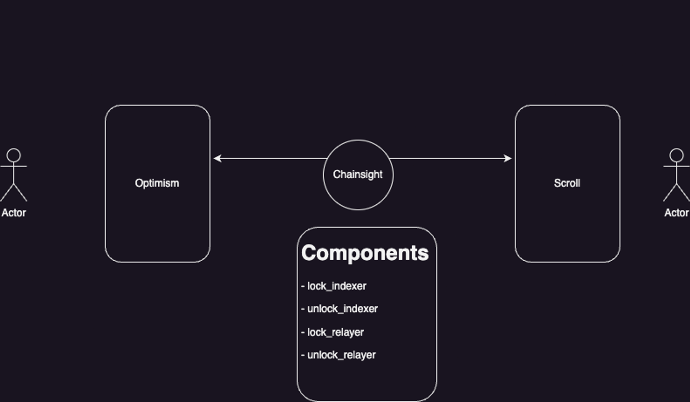

# demo-crosschain-lending

A demo of crosschain lending, using chainsight.

## Overview

This demo shows how to use the [chainsight](https://chainsight.network/) protocol to deposit assets on one chain, and then lend token on another chain, using deposit assets as collateral.
Also, it shows how to liquidate the collateral when the loan is not repaid. If the collateral is liquidated on the second chain, the deposit assets are released on the first chain to the liquidator.
This is [one of a series of demos](https://docs.chainsight.network/use-cases/demo3-cross-chain-lending) that show how to use chainsight to build cross-chain applications.



A working demo is available [here](https://cross-chain-lending-demo-ui.vercel.app/).


## Pre-requisites

- [Node.js](https://nodejs.org/en/)
- [Yarn](https://yarnpkg.com/en/)
- [Solidity](https://solidity.readthedocs.io/en/v0.8.9/installing-solidity.html)
- [Rust](https://www.rust-lang.org/tools/install)
- [dfx](https://internetcomputer.org/docs/current/developer-docs/setup/install)


## Setup


```bash
yarn

```

And .env file is needed, which contains the following information:

```bash
# .env
# mnemonic
MNEMONIC=test test test test test test test test test test test test
# alchemy api key
ALCHEMY_OPTIMISM_KEY=xxx
ALCHEMY_ARBITRUM_KEY=xxx
# etherscan api key
ETHERSCAN_OPTIMISM_KEY=xxx
ETHERSCAN_ARBITRUM_KEY=xxx
```


## Deploy and setup


Before setup, you need some ETH to pay for the gas fee on both chains(Optimism Goerli and Arbitrum Goerli) to run demo.
You can get some test ETH from [Optimism faucet](https://faucet.quicknode.com/optimism/goerli) and [Arbitrum faucet](https://faucet.quicknode.com/arbitrum/goerli).
Send ETH to the first and second addresses in the mnemonic.
The first user is the borrower, and the second is the liquidator.


1. Deploy contracts on the first chain

```bash
npx hardhat run scripts/0_deploy.ts --network optimismTest
```

And verify contracts on the first chain

```bash
npx hardhat run scripts/verify.ts --network optimismTest
```

2. Deploy contracts on the second chain

```bash
npx hardhat run scripts/0_deploy.ts --network arbitrumGoerli
```

And vefiry contracts on the second chain

```bash
npx hardhat run scripts/verify.ts --network arbitrumGoerli
```

3. Start dfx local network

```bash
dfx start 
```

4. Depoloy chainsight canisters on mainnet

```bash
./chainsight/scripts/0_update_addresses.sh
./chainsight/scripts/1_deploy_canisters.sh
```

5. Setup canisters

``` bash
./chainsight/scripts/2_subscribe.sh
./chainsight/scripts/3_send_ether.sh
```

## Run demo


1. Mint DAI on the first chain(Optimism Goerli) and lock it to another chain(Arbitrum Goerli)

``` bash
npx hardhat run scripts/2_mint_and_lock.ts --network optimismTest
```

2. Borrow TUSD on the second chain, using the locked DAI as collateral

``` bash
npx hardhat run scripts/3_borrow_on_dst.sh --network arbitrumGoerli
cd chainsight && dfx canister call lock_indexer_arbitrumGoerli save_logs && cd .. 
```

And you confirm `onLockCreated` tx [like this](https://goerli.arbiscan.io/tx/0x0fe3da814e730a37c66ce7e89a91b051c16a9f8bcc521d7464585c11fe0d2bc5) on the second chain.
This transaction is sent by the `lock_relayer_optimism` canister on local ICP, which is subscribed to the `lock` event of the `lock_indexer_optimism` canister.


3. Make TUSD oracle price high in order to liquidate the TUSD on the second chain

``` bash
npx hardhat run scripts/4_set_price.ts --network arbitrumGoerli
```

4. Liquidate the TUSD on the second chain on behalf of the second user

``` bash
npx hardhat run scripts/5_liquidate_on_dst.sh --network arbitrumGoerli
cd chainsight && dfx canister call unlock_indexer_arbitrumGoerli save_logs && cd ..
```

And you can confirm `unlock asset` tx [like this](https://goerli-optimism.etherscan.io/tx/0x22fbaed38640cb0ed5eb16398e8f9de0d058509bb171f30b7f916606067e4ddb)

This transaction is sent by the `unlock_relayer_arbitrum` canister on local ICP, which is subscribed to the `unlock` event of the `unlock_indexer_arbitrum` canister.

## More information

- About Chainsight
  - [Introduction - Chainsight Network](https://docs.chainsight.network/)
